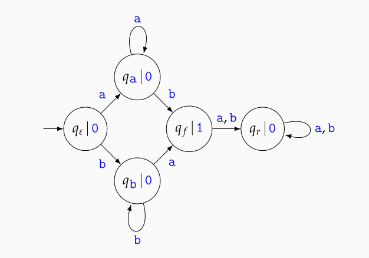

---
title: "Graphen Zusammenfassung"
lang: "de"
header-includes: |
    \usepackage{amsfonts}
    \usepackage{amsmath}
...

## Moore Automat

**definition:** ein Moore Automat $A=(Z,z_0,X,f,Y,h)$ ist festgelegt durch:

- endliche Zustandsmenge $Z$
- Anfangszustand $z_0 \in Z$
- Eingabealphabet $X$
- Zustandsüberführungsfunktion $f:Z \times X \longrightarrow Z$
- Ausgabealphabet $Y$
- Ausgabefunktion $h:Z \longrightarrow Y^*$

**wichtige Abbildungen:** 

$f_*$ definiert den Zustand, in dem man sich nach der Eingabe eines Wort befindet.

$f_*:Z \times X^* \longrightarrow Z$
\begin{align}
    f_*(z, \epsilon) &= z \\
    \forall w \in X^*: \forall x \in X: f_*(z,wx) &= f(f_*(z,w),x)
\end{align}

$f_{**}$ definiert eine hintereinanderreihung von Zuständen, die bei der eingabe eines Wortes durchlaufen werden.

$f_{**}:Z \times X^* \longrightarrow Z^*$
\begin{align}
    f_{**}(z,\epsilon) &= z\\
    \forall w \in X^*: \forall x \in X: f_{**}(z,wx) &= f_{**}(z,w) \cdot f_*(z,wx)
\end{align}

$g_*$ definiert die letzte Ausgabe nach der eigabe eines Wortes:

$g_*(z,w) = h(f_*(z,w))$ also $g_* = h \circ f_*$

$g_{**}$ definiert die konkatenation aller Ausgaben nach der Eingabe eines Wortes, insbesondere die Ausgabe des ersten Zustandes.

$g_{**}(z,w) = h^{**}(f_{**}(z,w))$ also $g_{**} = h^{**} \circ f_{**}$, wobei $g^{**}$ einfach g auf alle Zustände anwendet.

**zeichnen des Graphen:** in jedem Knoten befindet sich ein Zustand $z$ und durch $|$ getrennt die dazugehörige Ausgabe $h(z)$. auf den Pfeilen befinden sich die jeweiligen Eingaben

\newpage
### einfaches Beispiel:

- Eingabealphabet $X=\{a,b\}$
- Asgabealphabet $Y=\{0,1\}$

$g_*(q_\epsilon,aaaba) = h(f_*(q_\epsilon,aaaba)) = h(q_r) = 0$

$g_{**}(q_\epsilon, aaaba) = 000010$

\newpage
## endliche Akzeptoren
 
**Endlicher Akzptor:** ein endlicher Akzeptor $A=(Z,z_0,X,f,F)$ ist festgelegt durch:

- endliche Zustandsmenge $Z$
- Anfangszustand $z_0 \in Z$
- Eingabealphabet $X$
- Zustandsüberführungsfunktion $f:Z \times X \longrightarrow Z$
- eine Menge $F \subseteq Z$ akzeptierender Zustände

(im Gegensatz zu einem moore Automat gibt es kein Ausgabealphabet und Ausgabefunktion, sondern nur akzeptierende Zustände)

graphisch werden akzeptierende Zustände mit doppeltem Kringel dargestellt.

**Akzeptiert:** ein Wort $w \in X^*$ wird akzeptiert, falls $f_*(z_0,w) \in F$ ist, also wenn man nach der eingabe des Wortes in einem akzeptierenden Zustand endet.

**von Akzeptor akzeptierte Sprache:** Die von einem Akzeptor akzeptiert Sprache $L(A)$ ist die Menge aller akzeptierten Wörter: $L(A) = \{w\in X^*\,|\,f_*(z_0,w)\in F\}$

## Grenzen endlicher akzeptoren

Es gibt keinen endlichen Akzeptor mit $L(A)=\{a^kb^k\,|\,k\in N_0\}$.

### einfaches Beispiel:

- $F=\{q_f\}$ ist der einzigste akzeptierende Zustand
- $L(A)=\{a\}^+\{b\} \cup \{b\}^+\{a\}$

