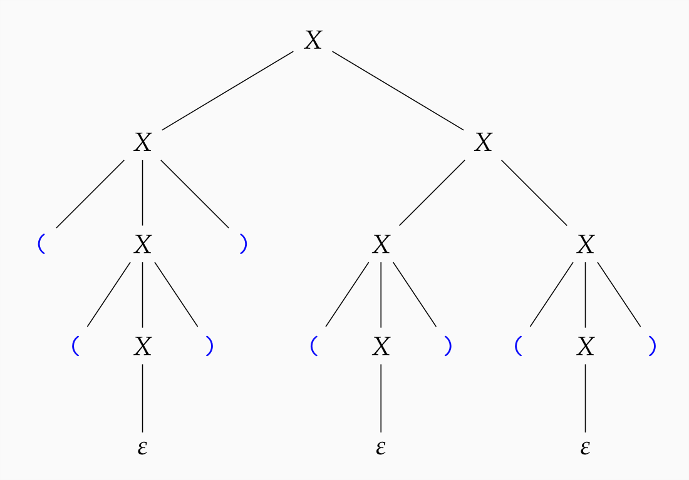

---
title: "Kontextfreie Grammatik Zusammenfassung"
lang: "de"
header-includes: |
    \usepackage{amsfonts}
...

**Kontextfreie Grammatik:** eine Kontextfreie Grammatik (Typ-2-Grammatik) $G=(N,T,S,P)$ beinhaltet:

- ein Alphabet $N$ von *Nichtterminalsymbolen*
- ein Alphabet $T$ von *Terminalsymbolen*
- das *Startsymbol* $S \in N$
- eine endliche Menge $P \subseteq N \times V^*$ von *Produktionen*, wobei $V=N\cup T$.

Wenn für ein Nichtterminalsymbol $X$ und ein Wort $w$ gilt, dass $(X,w) \in P$ ist, dann schreibt man diese sogenannte "Produktion" auch in der Form $X \rightarrow w$.

**Ableitungsschritt:** Eine Produktion bedeutet, dass man in einem Wort ein vorkommen eines Zeichens $X$, durch das Wort $w$ ersetzen kann. Dieses "ersetzen" nennt man auch einen Ableitungsschritt und wird formal aufgeschrieben als $u \Rightarrow v$, wenn es eine Produktion gibt, mit der man in einem Schritt von $u$ nach $v$ kommt. Dabei können nur *Nichtterminalsymbole* ersetzt werden. Wenn das resultierende Wort nur noch aus *Terminalsymbolen* besteht, kann nicht weiter abgeleitet werden.

Je nach grammatik ist es möglich von einem Wort mehrere neue Wörter abzuleiten.

Die Produktsionsmenge schreibt man meist vereinfacht in der Form: $\{X \rightarrow \epsilon\,|\,aXb\}$, wenn $(X,\epsilon) \in P$ und $(X,aXb) \in P$.

**Ableitungsfolge:** eine Ableitungsfolge ist eine Folge von Ableitungen und es ist definiert:

$u \Rightarrow ^0 v$ genau dann wenn $u=v$

$u \Rightarrow ^{i+1} v$ genau dann wenn für ein $w \in V^* : u \Rightarrow w \Rightarrow ^i v$

$u \Rightarrow ^* v$ genau dann wenn für ein $i \in N_0 : u \Rightarrow^i v$

**Linksableitung:** Eine Ableitungsfolge, bei der immer das linkeste Nichtterminalsymbol abgeleitet wird. Jede Ableitungsfolge kann zu einer Linksableitung umsortiert werden. Das liegt daran, dass die Grammatik *kontextfrei* ist und es somit egal ist, in welcher Reihenfolge die Ableitungen durchgeführt werden.

**Kontextfreie Sprache** Die von einer Kontextfreien Grammatik $G=(N,T,S,P)$ erzeugte formale Sprache ist definiert als $L(G)=\{w\in T^* \,|\, S \Rightarrow ^* w\}$. so eine Sprache nennt man dann auch *Kontextfreie Sprache*. 

### einschränkungen von Kontextfreien Sprachen

Es gibt zum Beispiel keine Kontextfreie Grammatik, die alle syntaktisch korrekten Javaprogramme ableiten kann.

## Beispiel 

Sei $G=(\{X\},\{(,)\},X,\{X \rightarrow XX|(X)|\epsilon \})$ eine Kontextfreie Grammatik. Die Wörter die $G$ erzeugt werden auch *wohlgeformte oder korrekte Klammerausrücke* genannt.

Dann gilt z.B.: $X \Rightarrow^* (())()()$

Eine "begründung" dazu kann auch in der Form eins **Ableitungsbaumes** angegeben werden.

{width=60%}

