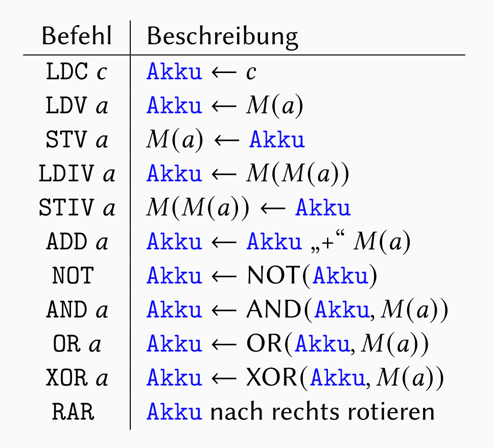
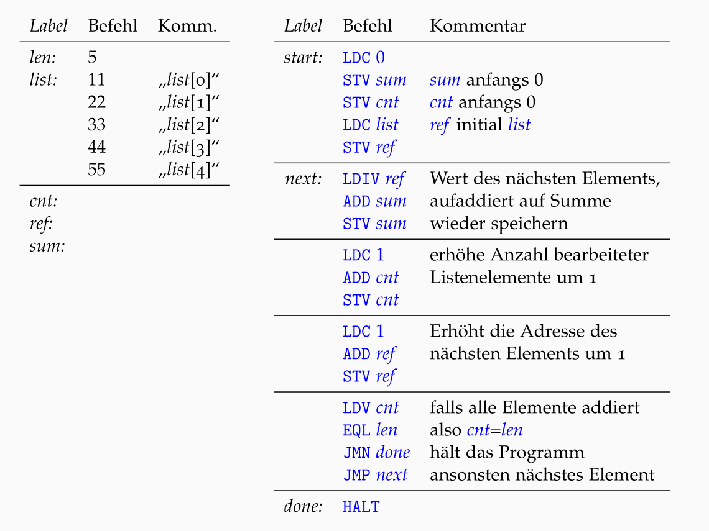

---
title: "MIMA Zusammenfassung"
lang: "de"
header-includes: |
    \usepackage{amsfonts}
...

# einfache Hardwarebausteine

**Draht:** Ein Draht führt von einem *Erzeuger* zu einem *Verbraucher* und kann die Zustände 0, 1 oder *nichts*(Z) haben. 

Ein Verbraucher hat einen *Eingang* auf dem er ein Bit lesen kann. Ein Erzeuger hat einen Ausgang auf dem er ein Bit schreiben kann. 

Beide können durch einen Draht verbunden werden. Ein Draht kann also seinen Zustand nicht speichern, sondern hat immer genau das Bit des Erzeugers, an den er angeschlossen ist.

**Bus:** *Drähte* können beliebig aneinandergeschlossen werden. Zum Beispiel wenn mehrere Enden verschiedener Drähte zusammengeführt werden. So entsteht ein Bus.

So kann ein Erzeuger zum Beispiel mehrere Verbraucher mit einem Bit versorgen. Außerem dürfen auch mehrere Verbraucher mit mehreren Erzeugern verbunden werden. Jedoch gibt es ein paar Regeln:

- zu jedem Zeitpunkt darf höchstens ein Erzeuger ein Bit übertragen.
- wenn ein Bit von einem Erzeuger übertragen wird, kann es jeder Verbraucher lesen.

**Speicher:** Ein Speicher besteht aus:

- interner Speicher M, der im Zustand 0 oder 1 ist.
- *Eingang:* Datenleitung zum entgegennehmen eines zu Speichernden Bit ($D_i$), wenn Steuerleitung $S_w$ auf 1 ist.
- *Ausgang:* Datenleitung zum ausgeben eines gespeicherten Bits ($D_0$), wenn Steuerleitung $S_r$ auf 1 ist.

Dabei ist wichtig dass niemals gleichzeitig $S_w$ und $S_r$ auf 1 gesetzt werden.

**Register:** Ein Register sind mehrere parallel geschaltete *Speicher*, wobei immer gleichzeitig auf alle Speicherelemente zugegriffen wird indem alle $S_w$ und $S_r$ Leitungen gleichzeitig angesprochen werden.

# MIMA

**Von-Neumann-Architektur:** Die Mima basiert auf der Von-Neumann-Architektur, welche besagt, dass alle Komponenten an einen zentralen Bus angeschlossen sind.

## Baugruppen

**Steuerwerk:** Das Steuerwerk regelt den Ablauf im Prozessor.

- Speichert im Instruktionsregister (IR) den aktuellen Maschienenbefehl.
- Speichert im Instruktionsadressregister (IAR) die Adresse des nächsten auszuführenden Befehls.

Ein Befehlt wird hier erst *dekodiert* und dann *ausgeführt*.

**Rechenwerk:** Das Rechenwerk führt die eigentlichen berechnungen durch. Daführ erhält es in den Registern X und Y jeweilige Eingabedaten, sowie einen *Operations-Code* vom Steuerwerk, der angibt, welche Operation auf den Daten ausgeführt werden soll. Am ende wird das Ergebnis in das Register Z geschrieben.

**Akkumulator:** Nach den meisten berechnungen des Rechenwerkes wird das Ergebnis der Rechnung noch in den Akkumulator geschrieben. Dieser ist das wichtigste Register zum Speichern von zwischenergebnissen.

**Speicherwerk:** verbindung des Prozessors zum Hauptspeicher. Zum einen sind hier die Maschienenbefehle des Programms gespeichert, zum anderen auch Daten die vom Programm verarbeitet werden sollen.

**Hauptspeicher:** Der Hauptspeicher der Mima ist mit 20 Bit addressierbar und hat somit $2^{20}$ Adressen. Jede Adresse speichert ein 24 Bit langes wort, welches auch Speicherwort genannt wird.

## Maschinenfehle der Mima

Programme für die Mima bestehen aus sogenannten *Maschinenbefehlen*, die aus dem Speicher geladen und ausgeführt werden können. Im eigentlichen Speicher werden diese Maschienenbefehle als 24 Bit-Folgen gespeichert. Jedoch gibt es zur einfacheren repräsentation eine art Symbolische Notation.

{width=60%}

### weitere Befehle:

Sprungbefehle:

- *JMP a* - führt Programm bei Addresse a fort.
- *JMN a* - springt nur, wenn erstes Bit des Akkumulators gleich 1 ist.

*EQL a* - schreibt $Akku = 111 \dots 111$, wenn $M(a)=Akku$. Sonst wird $Akku = 000 \dots 000$.

*Halt* - Programm hält an.

# Mikroprogrammsteuerung der MIMA

**Mikrobefehl:** Jedem Befehl sind Elementare Anweisungen zugeordnet, die die Mima schritt für schritt ausführen kann. Nach der Ausführung eines Befehls wird das IAR um eins erhöht.

**Mikroprogramm:** Programme, die aus einer Folge von mikrobefehlen bestehen.

**Steuersignale:** Signale die von dem Steuerwerk über Steuerleitungen z.B. an Register oder den externen Hauptspeicher geleitet werden, um dort einen Wert zu Lesen oder zu Schreiben.

**Meldesignale:** Signale, die über Meldeleitungen zum Steuerwerk hingeleitet werden, damit dieses auf Ereignisse reagieren kann.

## Befehlsphasen

Die Ausführung jedes Mikroprogramms besteht aus drei Phasen:

**Befehlsholphase:** Der nächste Maschienenbefehl wird aus dem Speicher ins Register *IR* geholt. Außerdem wird die Addresse des potenziell nächsten Befehls berechnet ($IAR++$). Jedoch kann sich die tatsächlich nächste Addresse während der Ausführung des Befehls noch ändern (z.B. bei *JM*).

**Befehlsdecodierphase:** Hier wird der Befehl decodiert. Die 8 höchstwertigen Bits des Speicherwortes codieren den auszuführenden Maschinenbefehl. In abhängigkeit von diesen 8 Bit und dem höchstwertigen Bit des Akkumulators verzweigt das Steuerwerk zu dem zum Maschienenbefehl zugehörigen Mikroprogramm.

**Befehlsausführungsphase:** hier wird das zum Befehl dazugehörige Mikroprogramm ausgeführt. 

# MIMA Programmbeispiel

Dieses Programm summiert die Elemente einer Liste von Zahlen.

Konkrete Addressen werden zur vereinfachung durch Labels ersetzt und *len* wird mit der Länge der Liste vorinitialisiert.

{width=80%}
