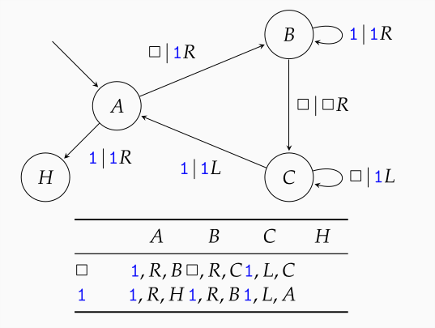
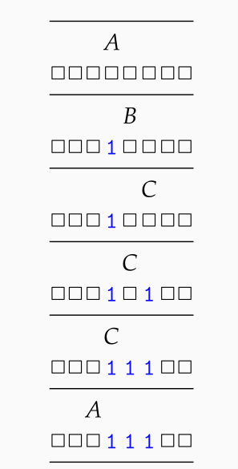

---
title: "Turingmaschine Zusammenfassung"
lang: "de"
header-includes: |
    \usepackage{amsfonts}
    \usepackage{amsmath}
...

# Definition

eine Turingmaschiene $T=(Z,z_0,X,f,g,m)$ besteht aus:

- Zustandsmenge $Z$
- Anfangszustand $z_0 \in Z$
- Bandalphabet $X$
- partielle Zustandsüberführungsfunktion $f:Z \times X \longrightarrow Z$
- partielle Ausgabefunktion $g:Z \times X \longrightarrow X$
- partielle Bewegungsfunktion $m:Z \times X \longrightarrow \{-1,0,1\}$

dabei sind die drei Funktionen $f$, $f$ und $z$ jeweils für die gleichen Eingaben definiert oder undefiniert.

Das Band einer Turingmaschine ist zwar unendlich groß, jedoch interessiert uns meist nur eine endliche Teilmenge. Dazu nutzen wir ein blank Symbol $\boxdot \in X$. Wir interessieren uns dann nur für die Teilmenge des Bandes, wo nicht das blank symbol steht.

**Konfiguration:** Eine Turingmaschine befindet sich zu jedem Zeitpunkt in einem „Gesamtzustand“, den wir eine Konfiguration nennen wollen. Dieser ist vollständig beschrieben durch: $c=(z,b,p)$

- aktueller Zustand $z \in Z$ der Steuereinheit
- aktuelle beschriftung des gesamten Bandes als Abbildung $b:Z \longrightarrow X$
- aktuelle Position $p \in Z$ des Kopfes

**Berechnung:** für jede Konfuguration $c=(z,b,p)$ einer Turingmaschiene kann dann ein Schritt durchgeführt werden, wenn für das Paar $(z,b(p))$ aus aktuellem Zustand und gelesenem Bandsymbol die Funktionen $f$, $f$ und $z$ definiert sind. Gegebenenfalls geht $T$ dann in die Konfiguration $c'=(z',b',p')$

(genaue definition im Skript)

Wir definieren $\bigtriangleup _1 :C_T \longrightarrow C_T, c'=\bigtriangleup _1(c)$ als die Funktion, die ausgehend vom Zustand $c$ die nach einem Schritt erreichte Konfiguration ausgiebt.

Analog zu $\bigtriangleup _1$ definieren wir $\bigtriangleup _t$ mit $t \in N_0$ als die Abbildung, die ausgehend von c, die nach t Schritten erreichte Konfiguration ausgiebt.

Wir definieren $\bigtriangleup _*(c)$ als Abbildung, die eine Endkonfiguration zurückgibt, falls diese existiert. Und sonst undefiniert ist.

**Endkonfiguration:** falls für ein $c$ die Nachfolgekonfiguration $\bigtriangleup _1(c)$ nicht definiert ist, heißt $c$ auch Endkonfiguration. Man sagt auch, die Turingmaschiene habe gehalten.

## Berechnungen

**endliche Berechnung:** endliche Folge von Konfigurationen $(c_0,c_1, \dots ,c_t)$ mit der Eigenschaft, dass für alle $0<i \le t$ gilt: $c_i=\bigtriangleup _1(c_{i-1})$. (folge von nacheinander berechneten Konfigurationen)

**unendliche Berechnung:** unendliche Folge von Konfigurationen mit der eigenschaft: für alle $0<i$ gilt: $c_i=\bigtriangleup _1(c_{i-1})$.

**haltende Berechnung:** endliche Berechnung, bei der die letzte Konfiguration eine Endkonfiguration ist.

**nicht haltende Berechnung:** eine Berechnung die nicht hält, also zum beispiel einfach unendlich weit nach rechts wandert.

## Eingabe von Turingmaschinen

Die Turingmaschiene benötigt ein Eingabealphabet $X \diagdown \{\boxdot\}$. Die eingabe eines Wortes $w \in A^*$ wird bewerkställigt, indem die Turingmaschine im Anfangszustand $z_0$ mit dem Kopf auf Feld 0 startet. Die so definierte Anfangskonfiguration wird $c_0(w)$ genannt.

Üblicherweise wird für Zahlen eine binäre darstellungsweise genutzt. Zum darstellen mehrerer Eingaben wird jedes mit [ und ] abgegrenzt. Zum Beispiel $\boxdot \boxdot \boxdot [0100][001]$

## Arten von Turingmaschinen

### Ausgabe auf dem Band

Eine Turingmaschine, die ein explizites Ergebnis mitteilen muss kann dies wieder über das Band tun, in dem in der Endkoniguration nur noch das Ergebnis auf dem Band steht. Dies nennt man eine "Turingmaschine mit Ausgabe auf dem Band".

### Turingmaschinenakzeptor

Verwendung einer Turingmaschine wie ein Akzeptor zur beschreibung einer akzeptierten Sprache. Diese Turingmaschiene wird dann auch Turingmaschinenakzeptor genannt.

**Akzeptierende Zustände:** Es wird eine Teilmenge von akzeptierenden Zuständen definiert. Ein Wort $w$ gilt als akzeptiert, wenn die Turingmaschine für Eingabe $w$ hält und der Zustand der Endkonfiguration ein akzeptierender ist. Es gibt also zwei gründe wieso ein Wort nicht akzeptiert werden könnte:

1. die Turingmaschine hält für eingabe $w$ in einem nichtakzeptierenden Zustand.
2. die Turingmaschine hält für eingabe $w$ nicht.

**Akzeptierte Formale Sprache:** Die von einer Turingmaschine akzeptierte formale Sprache $L(t)$.

**aufzählbare Sprache:** Die von einer Turinmaschine akzeptierte formale Sprache heißt auch aufzählbare Sprache.

**entscheidbare Sprache:** Wenn es eine Turingmaschine $T$ gibt, die $L$ akzeptiert und für alle Eingaben hält, dann ist $L$ entscheidbar und man sagt, dass $T$ die Sprache $L$ entscheidet.

\newpage
## einfaches Beispiel

eine Turingmaschine kann als Endlicher Automat oder auch als Tabelle representiert werden.

{width=50%}

Der jeweilige Zustand der Tuningmaschine wird über dem gerade besuchten Bandfeld notiert.

{height=40%}
