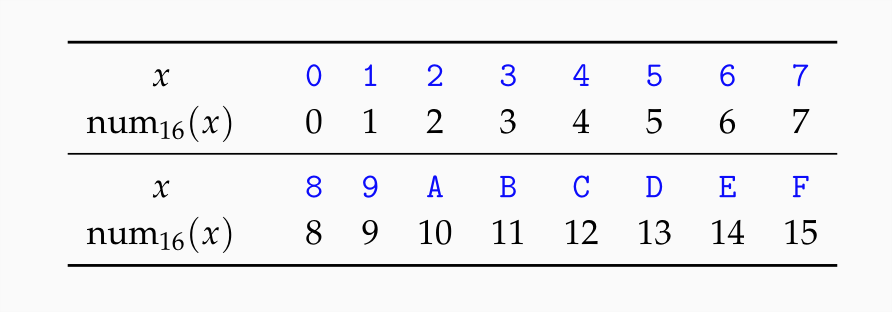
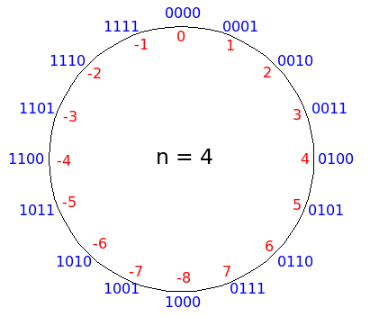
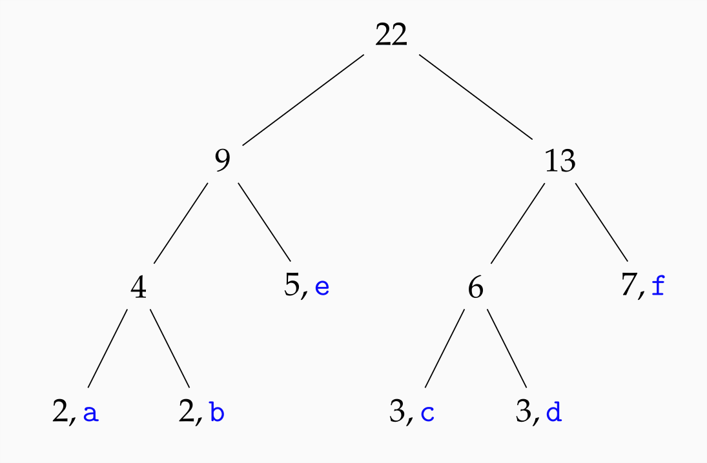

---
title: "Übersetzung und Codierung"
lang: "de"
header-includes: |
    \usepackage{amsfonts}
    \usepackage{amsmath}
...

\newcommand*\N{\mathbb{N}}
\newcommand*\R{\mathbb{R}}
\newcommand*\Z{\mathbb{Z}}

# Zahlendarstellungen

## Dezimaldarstellung

Wir sind es gewohnt Zahlen in Dezimaldarstellung zu representieren. Wir definieren eine Abbildung $num_{10}$, die aus der Dezimaldarstellung einer Zahl wieder eine Zahl macht.

{width=70%}

in der ersten Zeile stehen Zeichen, und in der zweiten Zeile stehen Zahlen. Genauer gesagt stehen in der ersten Zeile Zeichen, die für sich stehen und in der zweiten Zeile stehen Zeichen die als Zahlen representiert werden sollen.

Die Abbildung $num_{10}: Z_{10} \longrightarrow \Z_{10}$ macht also aus einem Zeichen eine Zahl.

Dazu wird $Num_{10}:Z_{10}^* \longrightarrow \N_0$ induktiv definiert als:

\begin{align}
    Num_{10}(\epsilon) &= 0\\
    \forall w\in Z_{10}^* \forall x \in Z_{10} : Num_{10}(wx) &= 10 \cdot Num_{10}(w) + num_{10}(x) 
\end{align}

## Binärdarstellung

Die Natürlichen Zahlen können auch mit nur zwei verschiedenen Ziffern $0$ und $1$ dargestellt werden. Dazu geht man bei der Definition analog zur Dezimaldarstellung vor:

Als Ziffernmenge nutzt man $Z_2 = \{0,1\}$ und definiert:

\begin{align}
    num_{2}(0) &= 0\\
    num_{2}(1) &= 1\\
    Num_2(\epsilon) &= 0\\
    \forall w\in Z_2^* \forall x \in Z_{2} : Num_2(wx) &= 2 \cdot Num_2(w) + num_2(x) 
\end{align}

### Beispiel

$num_2(00001101) = 8+4+0\cdot 2+1=13$

$num_2(10100) = 16+0\cdot 8+4+0\cdot 2+0\cdot 1= 20$

## Hexadezimaldarstellung

Bei der Hexadezimaldarstellung nutzt man 16 Ziffern des Alphabetes $Z_{16} =\{ 0,1,2,3,4,5,6,7,8,9,A,B,C,D,E,F\}$ (manchmal auch Kleinbuchstaben)

{width=70%}

Die Zuordnung von Wörtern zu Zahlen ist dann gegeben durch:

$\forall w\in Z_{16}^* \forall x \in Z_{16} : Num_{16}(wx) = 16 \cdot Num_{16}(w) + num_{16}(x)$

### Beispiel

$num_{16}(AB) = 16^1 \cdot 10 + 16^0 \cdot 12 = 172$

$num_{16}(BC2) = 16^2 \cdot 11 + 16^1 \cdot 12 + 16^0 \cdot 2$

# k-äre Representation

$Repr_k$ ist ein Abbildung, die eine beliebige Zahl als Eingabe bekommt und die Representation der Zahl zur Basis $k$ zurückgibt.

Man benutzt ein Alphabet $Z_k$ mit k Ziffern, deren Bedeutung die Zahlen in $\Z_k$ sind. Für $i \in \Z_k$ sei $repr_k(i)$ dann dieses Zeichen. $repr_k$ ist also genau die Umkehrfunktion zu $num_k$.

Repr wird dann so definiert:

$$ Repr_k(n) =
  \begin{cases}
    repr_k(n)  &  falls\, n < k\\
    Repr_k(n \,div\, k) \cdot repr_k(n \,mod\, k) & falls\, n \ge k
  \end{cases}
$$

Es gilt: $Num_k(Repr_k(n))=n$

Umgekehr gilt das aber im Allgemeinen nicht, da führende Nullen bei der Operation $Num_k$ wegfallen.

# Zweierkomplement

## bin

Als erstes benötigen wir eine Abbildung, die eine Zahl binär darstellt, aber mit einer festen Länge. Denn zum Beispiel in der MIMA haben die Speicherregister eine feste Länge, weshalb dort nur Werte mit dieser Länge gespeichert werden können.

$bin_l$ ist definiert als:

$bin_l:\Z_{2^l} \longrightarrow \{0,1\}^l, bin_l(n) = 0^{l-|Repr_2(n)|} Repr_2(n)$

Es werden also einfach so viele nullen von vorne aufgefüllt, dass $|bin_l(n)|=l$ gilt.

## Zkpl

Da aber auch negative Zahlen dargestellt werden sollen, wird dafür das Zweierkomplement genutzt, was so definiert ist:

$$Zkpl_l(x)=
  \begin{cases}
    0\, bin_{l-1}(x) & falls \, x \ge 0\\
    1\, bin_{l-1}(2^{l-1}+x) & falls \, x < 0
  \end{cases} 
$$

Negative Zahlen haben somit eine $1$ an erster Stelle und positive Zahlen eine $0$. Der Vorteil von der Zweierkomplementdarstellung ist, dass mit positiven, sowie negativen Zahlen ganz natürlich addiert werden kann.

**Menge aller Representierbaren Zahlen:** Die Menge der im Zweierkomplement representierbaren Zahlen ist definiert als $\mathbb{K}_l = \{ x \in \Z \,|\, -2^{l-1} \le x \le 2^{l-1} -1\}$

Man kann sich das Zweierkomplement auch wie eine Uhr vorstellen:

{width=40%}

# Übersetzung

Eine Übersetzung ist eine Zuordnung von Wörtern einer Sprache zu Wörtern einer anderen Sprache, sodass das Ausgangswort und dessen Übersetzung die selbe Bedeutung haben.

**sem:** $sem(w)$ ist die Bedeutung von einem Wort $w$. Diese kann so etwas einfaches sein wie eine Zahl, oder etwas kompliziertes wie die Ausführung eines Java-Programs.

**Übersetzung:** seien $A$ und $B$ zwei Alphabete und zwei Abbildungen $sem_A:L_A \rightarrow Sem$ und $sem_B:L_B \rightarrow Sem$ von zwei Formalen Sprachen in die selbe Menge von Bedeutungen.

Eine Abbildung $f:L_A \longrightarrow L_B$ heißt Übersetzung bezüglich $sem_A$ und $sem_B$, wenn $f$ die Bedeutung erhält, also:

$\forall w \in L_A: sem_A(w) =sem_B(f(w))$

**Codierung:** Eine injektive Übersetzung wird auch Codierung genannt.

**Codewort:** Für ein $w \in L_A$ wird $f(w)$ *Codewort* genannt.

**Code:** Die Menge $\{f(w) \,|\, w \in L_A\}$ aller Codewörter werden auch *Code* genannt.

Eine möglichkeit um Codierungen vollständig zu Spezifizieren ohne jedes Wort einzeln angeben zu müssen sind z.B. Huffman-Codes oder Homomorphismen.

**Homomorphismus:** seien $A$ und $B$ zwei Alphabete und $h:A^* \longrightarrow B^*$ eine Abbildung. $h$ ist dann ein Homomorphismus, wenn für jedes $w_1 \in A^*$ und jedes $w_2 \in A^*$ gilt:

$h(w_1 w_2)=h(w_1)h(w_2)$

**Epsilon-freier Homomorphismus:** Ein Homomorphismus ist *Epsilon-frei*, wenn für alle $x \in A$ gilt: $h(x) \neq \epsilon$

**Präfixfrei:** Für einen Homomorphismus ist meist nicht einfach zu sagen, ob er eine Codierung ist. Wenn $h$ jedoch *präfixfrei* ist, kann man direkt sage dass $h$ auch eine Codierung ist. $h$ ist präfixfrei, wenn für keine zwei verschiedene Symbole $x_1,x_2 \in A$ gilt: $h(x_1)$ ist ein Präfix von $h(x_2)$

**Decodierung von Präfixfreien codes:** Präfixfreie Codes sind besonderst einfach zu decodieren. Jedoch ist zu Beachten, dass nicht alle Wörter aus $B^*$ ein Codewort sind, da $h$ im allgemeinen nicht surjektiv ist. 

Um die Decodierung trotzdem als totale Abbildung definieren zu können führen wir das Symbol $\perp$ ein. Dieses wird benutzt, wenn ein $w \in B^*$ nicht decodiert werden kann. Die Decodierung ist nun die Abbildung: 

$u:B^* \longrightarrow (A \cup \{\perp\})^*$

falls ein $w \in B^*$ nicht definiert ist, soll $u(w)$ das Symbol $\perp$ sein.

## Gründe für Übersetzungen:

- Kompression
- Fehlererkennung/Fehlerkorrektur
- Lesbarkeit

# Huffman Codierung

- Huffman-Codes sind die kürzesten präfixfreien Codes die es gibt.
- ein Huffman-code ist nicht eindeutig
- die Codierung wird dabei auf das Eingabewort angepasst
- Zeichen die öfter vorkommen werden mit einem kürzeren Codewort versehen.

## Berechnung von Huffman-codes

Es ist ein Wort $w$ gegeben.

1. für jedes vorkommende Zeichen in $w$ wird die Anzahl der Vorkommen dieses Zeichnes herausgeschrieben.
2. Diese Zahlen werden nach größe sortiert aufgeschrieben. (zusätzlich wird das Zeichen daneben geschrieben)
3. Jetzt werden die beiden kleinsten Zahlen durch Äste nach oben verbunden und der Knoten bekommt als Beschriftung die Summe der beiden Ausgangswerte.
4. schritt 3 wird mit allen Knoten wiederholt, bis es eine Wurzel gibt.
5. Die Kanten des Graphen  die nach links gehen, werden jetzt mit nullen beschriftet, und die Kanten die nach rechts gehen mit einsen.
6. Jetzt kann der Code für jedes Zeichen entlang der Kanten abgelesen werden.

## Beispiel

sei $w=afebfecaffdeddccefbeff$, ein Wort. Dann ergibt sich durch den Algorithmus zur Berechnung eines Huffman-Codes der folgende Baum:

{width=60%}

Von diesem Baum kann dann wiederem der Folgende Code abgelesen werden:

- a = 000
- b = 001
- c = 100
- d = 101
- e = 01
- f = 11

## Blockcodierung

Eine Blockcodierung ist eine Huffman-Codierung, die statt einzelnen Zeichen ganze Blöcker einer festen Länge nutzt.
